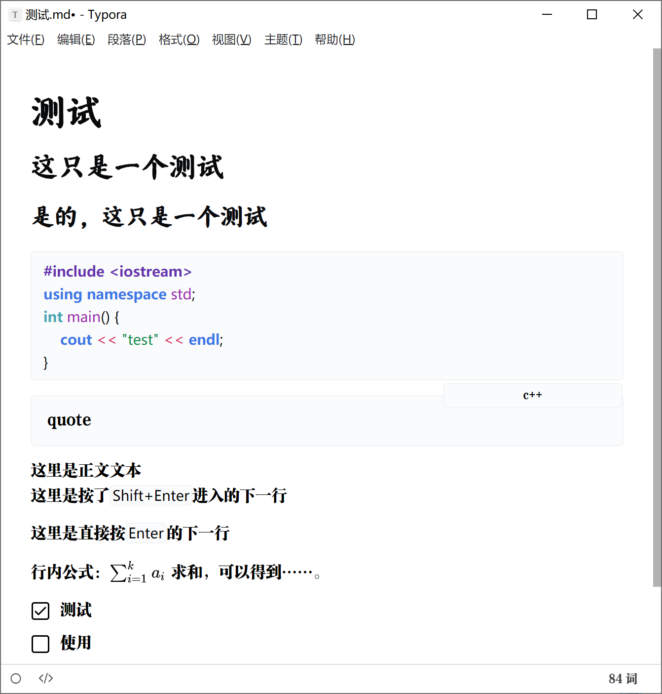
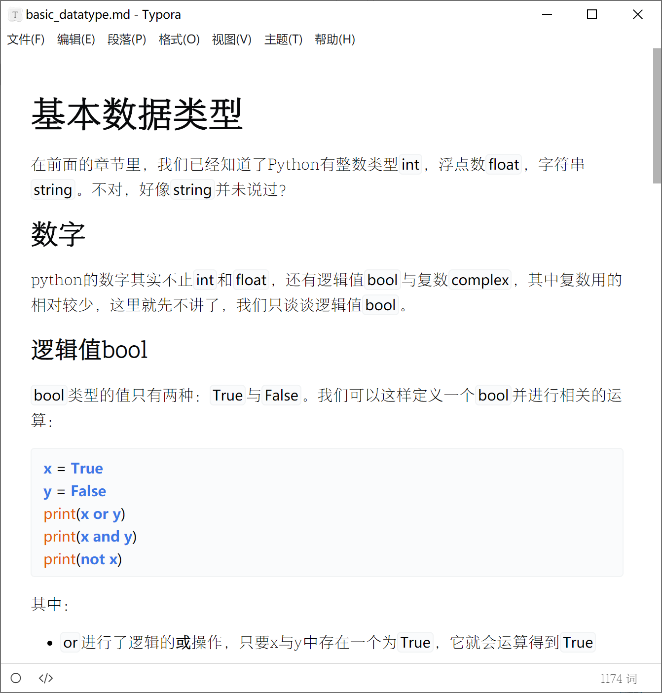

# fluent-wr786
 a Markdown Theme for self use

> Based on Theme `fluent`

## Demo

### v0.1



### v0.2



## Usage

### Typora

将`fluent-wr786.css`与`fluent-wr786`文件夹放入`typora`主题文件夹（或者其他MarkDown编辑器的）

### VSCode

编辑`settings.json`

```json
"markdown.styles": [
    "https://cdn.jsdelivr.net/gh/wr786/fluent-wr786/fluent-wr786.css"
],
```

